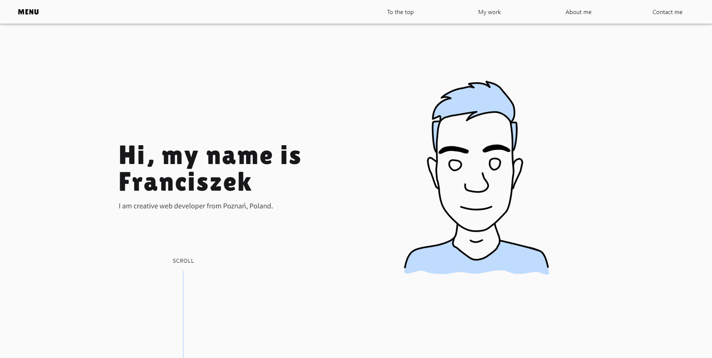
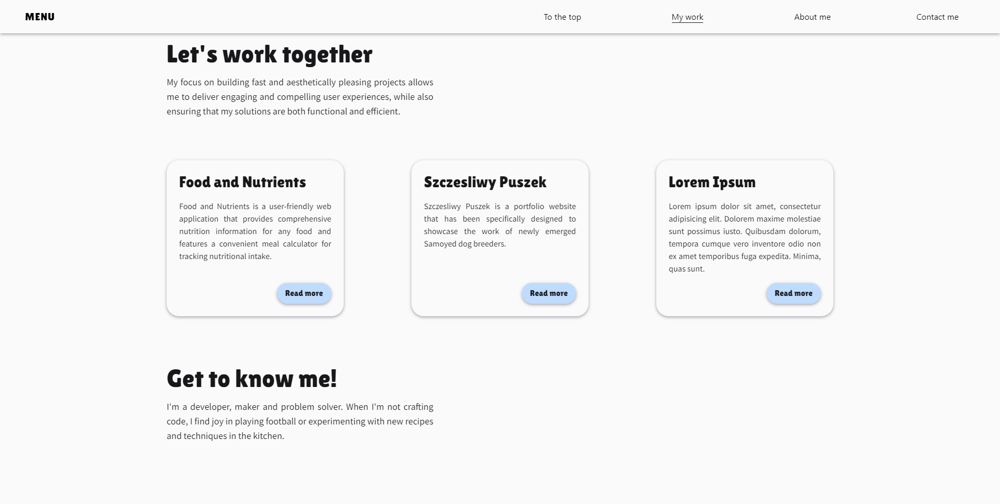
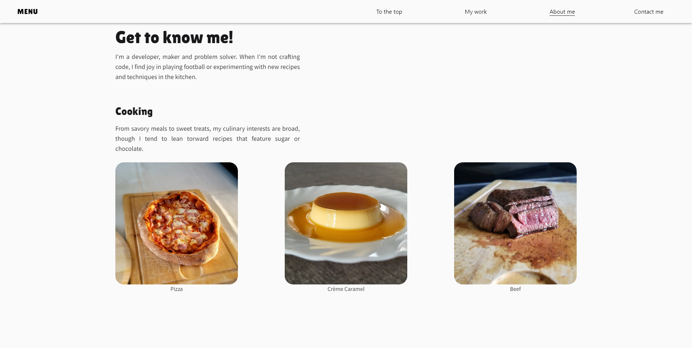

# franciszekczajka.me

> My personal portfolio website to showcase my work and skills. With a passion for crafting innovative and captivating web experiences, I have meticulously created this platform to provide visitors with an immersive glimpse into my skill set and notable achievements.

## Table of Contents

-   [Demo](#demo)
-   [Site](#Site)
-   [Technologies Used](#technologies-used)
-   [Setup](#setup)
-   [Usage](#usage)
-   [Project Status](#project-status)
-   [Room for Improvement](#room-for-improvement)
-   [Acknowledgements](#acknowledgements)
-   [Contact](#contact)

## Demo

> Working live demo is [_here_](https://www.franciszekczajka.me/).

## Site

### Landing page



### My work



### Who am I?



## Technologies Used

-   NextJS - version 13.1.6
-   TypeScript - version 4.9.5
-   TailwindCSS - version 3.2.7
-   React Toastify - version: 9.1.2

## Setup

To run this project, install it locally using npm:

```
$ git clone https://github.com/fczajka/portfolio.git
$ cd portfolio
$ npm install
```

## Usage

Once you complete the setup, run `npm run dev` to start the application. You will then be able to access it at localhost:3000. After doing so, you are good to go.

## Project Status

Usable, still under construction.

## Room for improvement

-   Make it work without JavaScript enabled
-   Refactor code

## Acknowledgements

This project was inspired by https://robbowen.digital/

## Contact

Created by [@fczajka](mailto:franekczajkaa@gmail.com) - feel free to contact me!
